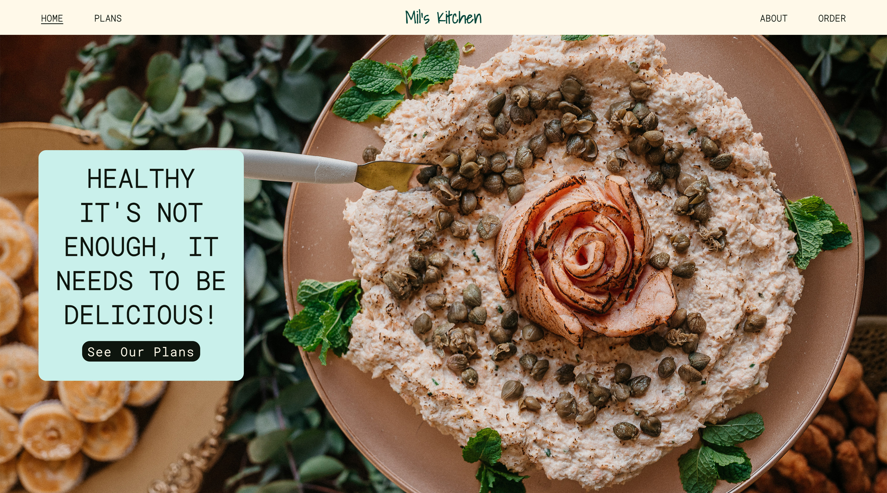

# Mil's Kitchen
(Developer: Valentino Braga)

Mil's Kitchen is a small business created by a Brazilian chef with the mission of providing healthy food that tastes like home. The site is the face of Mil's Kitchen online and aims to provide information about meal plans and how to order them. My goal with this project was to create a clean, modern design that evokes the feeling of natural food and home.

[Live Website](https://tinobragaa.github.io/mils-kitchen/)

# Table Of Contents

- [Mil's Kitchen](#mil-s-kitchen)
- [User Experience (UX)](#user-experience--ux-)
  * [Business Goals](#business-goals)
    + [User Goals](#user-goals)
    + [Website Owner Goals](#website-owner-goals)
    + [Target Audience](#target-audience)
    + [User Expectations](#user-expectations)
  * [User Stories](#user-stories)
    + [First-Time User](#first-time-user)
    + [Returning User](#returning-user)
    + [Site Owner](#site-owner)
- [Design](#design)
  * [Wireframes](#wireframes)
  * [Typography](#typography)
  * [Colour Palette](#colour-palette)
  * [Imagery](#imagery)
  * [Structure](#structure)
- [Features](#features)
    + [Sticky Navigation Bar - Stylish Button](#sticky-navigation-bar---stylish-button)
    + [Hoover Border Effect](#hoover-border-effect)
    + [Icons](#icons)
    + [Home Page Hero Image Section - Stylish Button](#home-page-hero-image-section---stylish-button)
    + [Home Page Select Your Plan Section](#home-page-select-your-plan-section)
    + [Home Page How It Works Section](#home-page-how-it-works-section)
    + [Home Page Meet The Chef Section](#home-page-meet-the-chef-section)
    + [Plans Page](#plans-page)
    + [About Page](#about-page)
    + [Order Page](#order-page)
    + [Footer](#footer)
- [Future Features](#future-features)
  * [Hamburguer Menu](#hamburguer-menu)
  * [Our Food Display](#our-food-display)
  * [Products Page](#products-page)
- [Technologies Used](#technologies-used)
  * [Languages](#languages)
  * [Frameworks and Tools](#frameworks-and-tools)
- [Testing](#testing)
  * [HTML Validation](#html-validation)
  * [CSS Validation](#css-validation)
  * [Accessibility](#accessibility)
- [Bugs](#bugs)
- [Deployment](#deployment)
  * [Fork](#fork)
  * [Clone](#clone)
- [Credits](#credits)
  * [Concepts References](#concepts-references)
  * [Coding References and Tutorials](#coding-references-and-tutorials)
- [Acknowledgements](#acknowledgements)
  
# User Experience (UX)

## Business Goals

### User Goals
- Find healthy food
- See a diverse menu
- Order weekly food
- Learn what makes this company different
- Meet the chef to see who's cooking their daily food
- Be able to reach out to the company for more information

### Website Owner Goals
- Deliver clear and easy-to-read information
- Increase the traffic and sales
- Showcase photos of the weekly dishes
- Provide a form to enquire about services provided

### Target Audience
- Adults looking for healthy, tasty options for their day-to-day meals
- People on diets that need help cooking their food
- Adults who don't have time to cook
- Vegetarians

### User Expectations
- Easy access to information
- Simplicity to complete order
- Appealing design
- Accessibility
- Access to important links (social media links)

## User Stories

A busy young adult living in the city and using food delivery services who wish to have a more healthy diet.
Vegetarian person struggles to find diverse options for their day-to-day meals.
A mother looking for help to cook a specific diet for their kids.
An adult who doesn't know how to cook but wishes to have a healthy day-to-day meal.
An adult who wishes to buy food that tastes like home.

### First-Time User
1. As a first-time user, I want to understand the service
2. As a first-time user, I want to understand how I can order
3. As a first-time user, I want to be able to easily order
4. As a first-time user, I want to have a sense of safety buying this service
5. As a first-time user, I want to know who is providing this service
6. As a first-time user, I want to understand how I can easily receive updates from this service

### Returning User
9. As a returning user, I want to see the new meals options
10. As a returning user, I want to smoothly navigate the website
11. As a returning user, I want to order my meal plan easily

### Site Owner
13. As a site owner, I want customers to easily understand my service
14. As a site owner, I want customers to be able to order with no issues
15. As a site owner, I want ways to retain costumers

# Design

The website is designed as four separate pages to enable the user to easily and precisely locate the information they are looking for. The priorities on the site are the information about the plans and the weekly dishes. For this reason we start with a call to action button followed by plans options, how to order and meet the chef sections, bringing an intuitive user flow. The contact page features a form where the users can select and inquire about the choosen plan.

The concept behind of the business is healthy food, plant-based as much as possible and home cooking. This is reflected in the pastel colour palette, in the smooth layout and the showcasing the chef behind the curtains.

## Wireframes

The initial concept of the design can be seen here and they were made through the Balsamiq wireframing software. 

Basic Structure Wireframe

 

Home Page Wareframe

 

Plans Page Wareframe

 

About Page Wareframe

 

Order Page Wareframe

 

## Typography

Ronoto Mono and Shadows Into Light fonts were chosen from Google Fonts. Fonts were selected to represent clear, easy-to-read and 'warmer' feel they inspire in the user.

## Colour Palette

Colour is a very important aspect for engaging with the audience, the colour theme is based around the color: #FFF9EA. The other colors were chosen to tone with this and keep to the overall theme of natural colours. The colors choice was made with the help of the ColorSpace and Coolors website.

* [ColorSpace](https://mycolor.space/)
* [Coolors](https://coolors.co/)

The colours were tested on Webaim using their contrast checker. In all combinations of colors, the ratio was higher than 14.00:1 meaning that they are a great fit.

#FFF9EA + #0E150E = ratio 17.65:1.

#CAF0EA + #0E150E = ratio 15.15:1.

#DCE6C1 + #0E150E = ratio 14.24:1.

#FFF9EA + #0E150E = ratio 14.24:1.

## Imagery

Images are located in every pages All pages have the same thematic layout, and the layout should be consistent on all pages, including the home page. Images were downloaded from Pixabay, Pexels and drawed by the illustrator Hefestus Cave (exclusively for this project). The images are styled with curved borders which is modern and gives a softer effect which is more pleasing to the user.

* [Pexels](https://www.pexels.com/)
* [Unsplash](https://unsplash.com/)
* [Hefestus Cave](https://www.instagram.com/hefestuscave/)

Icons were used for social links and buttons. The icons used on the site were taken from:

* [Font Awesome](https://fontawesome.com/)

## Structure 

To keep the user interface easy and smooth as possible, I choose the sticky nav bar style and a storytelling mode. The theme remains the same throughout all four pages:

- Home Page: Shows the appealing hero image with a call to action to see the plans, followed by the plans options, followed by the how it works section, followed by meet the chef section and then the footer with another small navigation and social media.
- Plans Page: Showcase the week's meals and explain the personalised plan.
- About Page: Allows the users to see ethos of the business.
- Order Page: Gives users a chance to communicate with the company and start placing an order.

# Features

The website contains 6 pages (home page, plans page, about page, contact page, form submitted page and 404 page) and 12 sections. 

### Sticky Navigation Bar - Camouflaged Effect
- Sticky Navigation Bar
- Camouflaged color creating an stylish effect 
- Shows on every page
- The nav links shrink on smaller screens making it responsive
- Enables easy and smooth navigation

Sticky Navigation Bar

 

Camouflaged Effect

 

 

### Hoover Border Effect
- Every link across the website has a border when its hoovered
- The border stays activated when you are inside the clicked page

Hoover Border Effect

 

 

### Icons
- Links to social medias at the footer
- Small mouse to appoint a link which redirects to a certain area of a different page

Footer Icons

 

Mouse Icon

 

 

### Home Page Hero Image Section - Stylish Button
- Makes the website more appealing and professional looking
- Stylish eye catching button with hoover effect
- Call to action 

Hero Image

 

Stylish Button

 

 

### Home Page Select Your Plan Section
- Guide the user through the plans option
- Plan explanation
- Link to see the weekly dish 

Select Your Plan Section

 

 

### Home Page How It Works Section
- Caught user eyes while explaining the process, enhancing their experience
- Hoover effect for stylish effect

Hoover Explanation Circles 

 

 

### Home Page Meet The Chef Section
- Meet the chef behind the curtains
- Explore the company history ad ethos

Meet The Chef Section

 

 

### Plans Page
- Showcase the weekly food
- Explanation of the personalised plan
- Stylish button in the same layout of the home page

Traditional Section

 

Vegetarian Section

 

Personalised Section

 

 

### About Page
- Meet the chef behind the curtains in details
- Learn the company history and ethos

About Page Sections

 

 

### Order Page
- Form to order
- Succesfull message for submitted form

Form Section

 

Thank You Message

 

 

### Footer
- Social media links
- Pages links

Footer

 

 

# Future Features

A few features that could make the website even better are listed here.

### Hamburguer Menu

Add hamburger menu for screen of 950px wide and down.

### Our Food Display

Add a fith section on the home page show casing the weekly dishs. Updated every week.

### Products Page

Add another page where it's possible to sell merchandise, condiments, butters and bread (unity).

# Technologies Used

### Languages
The following languages were used to develop the website:
- HTML
- CSS

### Frameworks and Tools
The following frameworks and tools were used to develop the website:
- Git
- Github
- Gitpod
- Devtool
- Balsamiq
- Google Fonts
- Font Awesome
- Adobe Photoshop 2023
- Adobe Lightroom Classic
- Techsini Mockup Generator
- W3C Markup Validation Service

# Testing

### HTML Validation

The Nu HTML Checker (W3C) is used to validate HTML documents. The page passed without any errors.

### CSS Validation

The W3C Jigsaw CSS Validation Service is used to validate CSS documents. The page passed without any errors.

### Accessibility

The WAVE web accessibility evaluation tool by WebAIM was used to ensure the webpages met accessibility standards. All 5 pages passed without any errors.

Responsive test on multiple devices
The following devices were used to ensure the site was responsive:

- Ipad Pro
- Galaxy S20
- Macbook Pro
- Iphone 13 Pro
- Iphone 14 Pro Max
- Notebook Acer Predator Helios 300

# Bugs
Bug: A white bar appeared on the right side of the screen on responsive tests when under 400px.
Fix: The width of certain elements were set in non responsive way through a fixed width (px). The width was changed to %.

Bug: The sticky navigation bar wasn't working.
Fix: Added a container element wrapping all the others.

# Deployment

The website was deployed through the use of GitHub Pages, a feature built in to GitHub. This can be done by following the steps below.
1. In the desired repository, click on "Settings" from the top menu.
2. From the side menu to your left, select "Pages" in the "Code and automation" section.
3. Make sure the "Source" option is set to "Deploy from a branch"
4. Select the desired "Branch" from the drop down below (main branch in most cases, making sure the director is set to /(root)).
5. Select "Save", and after it refreshes the page, you will see a box at the top of the page providing you with the URL of your now published site.

To contribute or check the code yourself, you can fork or clone the repository as well.

## Fork
1. Go to the desired repository
2. Click "Fork" in the upper right corner
3. Select the owner, and set the repository name. A description can be added if desired
4. Choose whether to copy the default branch, or all branches
5. Click "Create Form"

## Clone

1. Go to the desired repository
2. Click the "Code" button at the top of the files section of the page
3. Select your desired method for cloning (HTTPS/SSH/GitHub CLI)
4. Open Git Bash
5. Change the current working directory to the location where you want the cloned directory
6. Type "git clone", and then paste the URL you copied earlier. It will look like this, with your GitHub username instead of "YOUR-USERNAME": "$ git clone https://github.com/YOUR-USERNAME/DESIRED-REPOSITORY"
7. Press Enter. Your local clone will be created.

[Click Here To See The Live Website](https://tinobragaa.github.io/mils-kitchen/)

# Credits

A list of references used for the site:

## Concepts References

* [Farmacy London](https://farmacylondon.com/)
* [The Butchers Daughter](http://thebutchersdaughter.ie/)
* [Ganic Lab](https://www.ganiclab.com.br/)
* [sweetgreen](https://www.sweetgreen.com/)
* [Beatnic](https://www.eatbeatnic.com/)
* [Behance](https://www.behance.net/)

## Coding References and Tutorials

* [Sticky Navigation Bar](https://codepen.io/Eslam_Refa3y/pen/jONzrza)
* [Codepen](https://codepen.io/trending)
* [Learn Flexbox](https://www.codecademy.com/learn/learn-css-flexbox-and-grid)
* [Box Shadow](https://www.w3schools.com/cssref/css3_pr_box-shadow.php)
* [Responsive Web Design](https://www.youtube.com/watch?v=VsNAuGkCpQU)
* [Behance](https://www.behance.net/)
- Love Running Project

# Acknowledgements

I would like to take this opportunity to acknowledge and thank the following people:

- My mentor, Brian, for our sessions and advices.  
- My actual manager, Saoirse, for letting me study.
- A big thank you for everybody on Code Institute's Slack Channels.
- My friend Dion, who is a front end developer and for the insights given. 
- Barbara, tutor from Code Institue, you are a star. Thank you for the help.
- My loved husband, Adson Aquino, who's always by my side. And also because he drew 3 images for this first project.
- My sister, Dana Braga, who without knowing how to develop, were able to help me when I was lost. Thank you for the long hours of nerve wrecking and your brilliance.